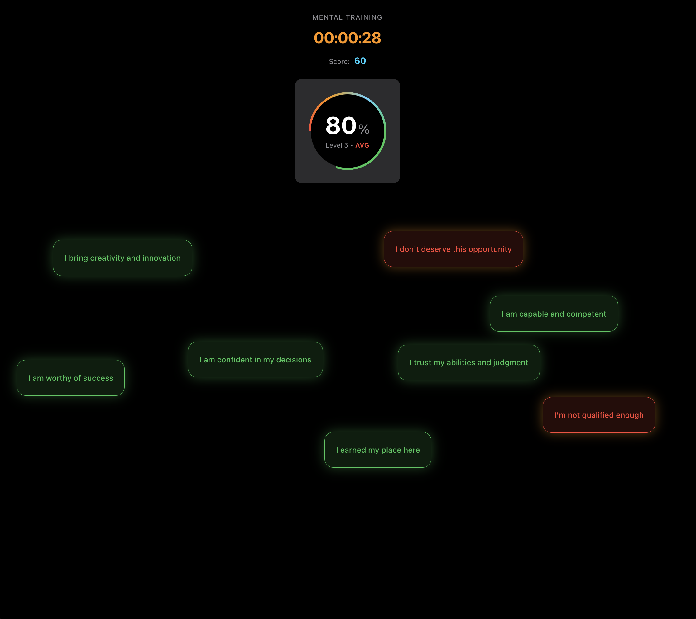
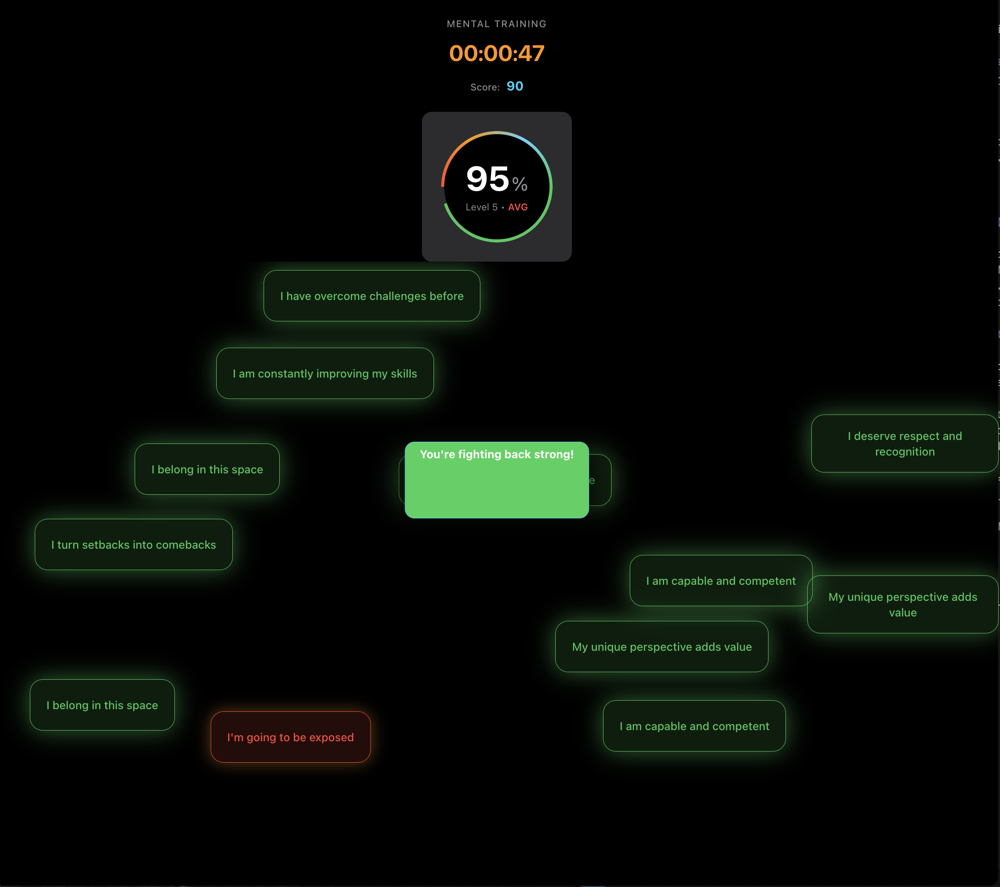
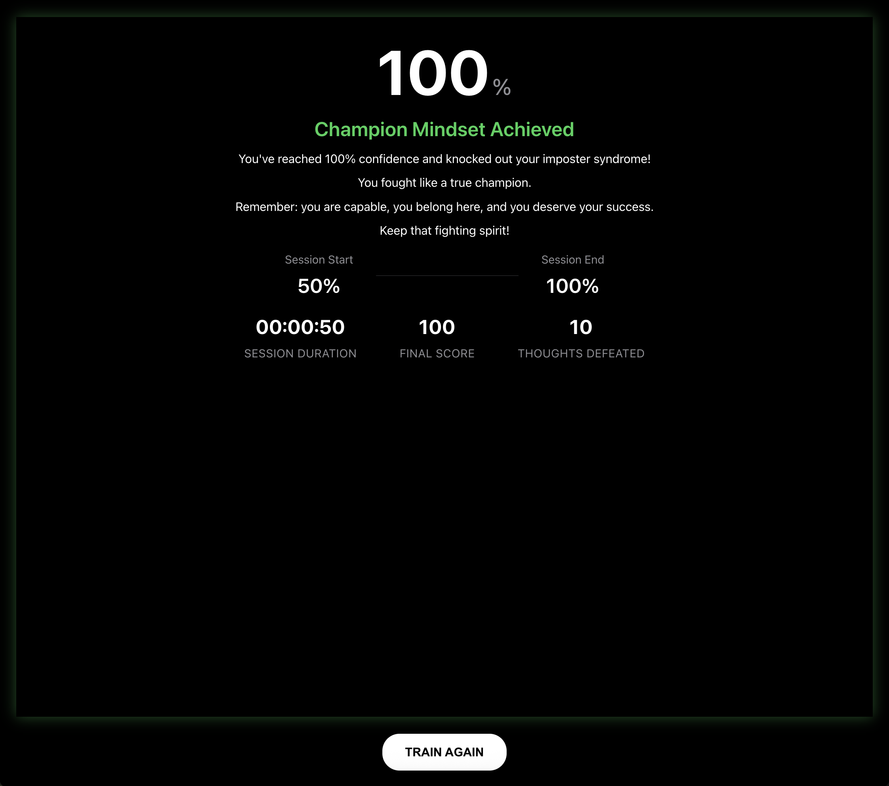

# Imposter Syndrome Defeato

Fight self-doubt, one punch at a time.
A fun, interactive boxing game built to help people fight back against imposter syndrome by literally punching away negative self-talk.

## Project Description

Imposter Syndrome Defeato is a motivational interactive web-based game that turns the abstract battle against self-doubt into a tangible and empowering experience. Players use their cursor as a boxing glove to punch negative thoughts that appear on the screen, earning points and building a “confidence meter.” To reinforce positive thinking, uplifting affirmations also appear, which are meant to be left untouched as a source of encouragement. The game provides a simple yet powerful way to practice mindfulness and reframe negative thought patterns.

## Project Screenshots

**Live Demo (Hosted on Appwrite Sites):** [https://imposter-syndrome-defeato.appwrite.network/](https://imposter-syndrome-defeato.appwrite.network/)

## A Note on the Live Demo

The original and full-featured version of this game uses the AWS Polly voiceover feature to provide real-time, text-to-speech voiceovers to read the positive affirmations aloud. This creates a more immersive and encouraging experience that is highly recommended.
To see this feature in action, please watch the 40-second demo video:
[Watch it here](https://youtu.be/XXr-xd72tIw)
For the live version deployed on Appwrite Sites, the text-to-speech functionality has been disabled. This was a deliberate and responsible decision made for cost management, ensuring the site can remain freely accessible to everyone without incurring high AWS costs from public traffic. The full code for the Polly integration remains in this repository for anyone who wishes to run it locally.

## Inspiration Behind The Project
Along my studying and career journey, I’ve felt the weight of imposter syndrome firsthand. I wanted to create something that wasn’t just another app, but a tool that could genuinely help others who feel the same way. The goal was to build a “wild card” project that was both fun and meaningful, turning a difficult internal struggle into an interactive game.
This project was a fantastic learning experience, not just in coding, but in using modern development tools to bring an idea to life quickly and securely.

## Tech Stack & Features
	•	Frontend: Plain Vanilla JavaScript, HTML5, and CSS3 were used to ensure the game is lightweight, fast, and accessible on any modern web browser without the need for complex frameworks.
	•	Deployment & Hosting: The entire application is deployed and hosted on Appwrite Sites. Appwrite provided an incredibly fast, intuitive, and secure platform to take this project from a local folder to a live, public URL in minutes. Its seamless integration with GitHub made the deployment process effortless.
	•	AI-Powered Voiceovers: The full-featured version of the game integrates AWS Polly, a powerful text-to-speech (TTS) service. This feature brings the positive affirmations to life by speaking them aloud, creating a more immersive and impactful motivational experience.
 
## Why Appwrite?
For this project, Appwrite was the perfect choice. To build the satisfying user experience, I needed a platform that would handle the complexities of deployment without a steep learning curve. Appwrite Sites allowed me to deploy a secure, fast, and reliable version of my game with just a few clicks, offering more than enough resources to build and share this project with the world.
I highly recommend Appwrite for any developer looking for an open-source, developer-friendly alternative to other backend services (Learn more at appwrite.io).

## License

This project is licensed under the MIT License. See the `LICENSE` file for details.
