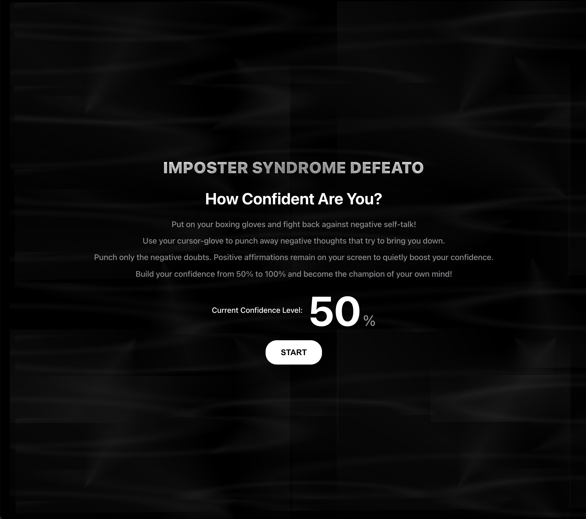

# Imposter Syndrome Defeato

A web-based boxing game to help you fight back against negative self-talk. This is one of my wildcard projects.

**Live Demo:** [https://imposter-syndrome-defeato.appwrite.network/](https://imposter-syndrome-defeato.appwrite.network/)

## Project Screenshots




## Project Screenshots
Video Demo: [Watch it here](https://youtu.be/XXr-xd72tIw)

## About The Project

This game was designed to be an interactive, empowering tool to help people overcome imposter syndrome. Players "punch" negative thoughts to build their confidence, while positive affirmations remain on screen as a source of encouragement.

### Full-Featured Version (with AI Voiceover)

The full version of this app uses **AWS Polly** to provide real-time, text-to-speech voiceovers for the positive affirmations, creating a more immersive and encouraging experience. This feature is included in the source code but is disabled in the live public demo to manage costs. Please watch the video demo above for a preview of this functionality.

## How to Run the Full-Featured Version Locally

To run the version that includes the AWS Polly text-to-speech feature, you will need your own AWS credentials.

1.  Clone this repository to your local machine.
2.  Create a file in the root directory named `.env`.
3.  Add your AWS credentials to the `.env` file like this:
    ```
    VITE_AWS_ACCESS_KEY_ID=YOUR_AWS_ACCESS_KEY
    VITE_AWS_SECRET_ACCESS_KEY=YOUR_AWS_SECRET_KEY
    ```
4.  Open the `index.html` file in your browser to run the game locally with the voiceover feature enabled.

## License

This project is licensed under the MIT License. See the `LICENSE` file for details.
